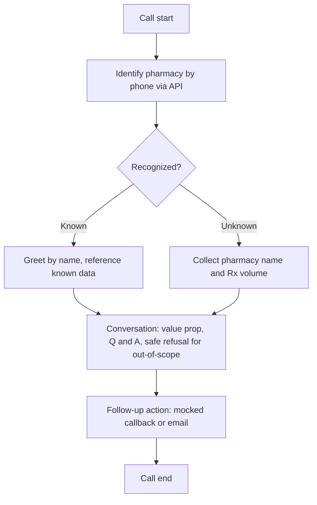
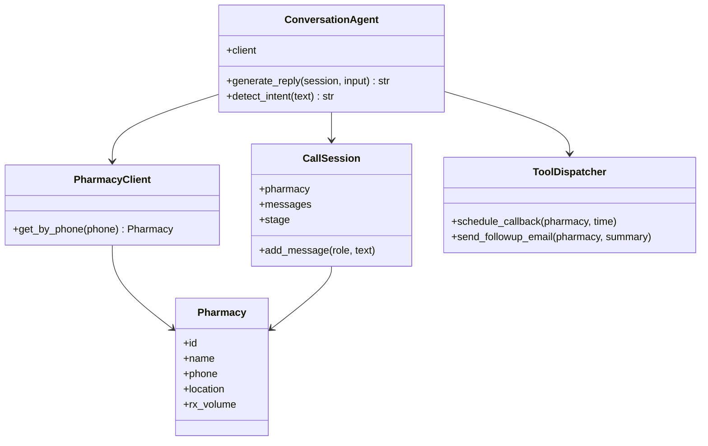

# Inbound Pharmacy Sales Agent — Design Doc

## Overview
TJM Labs gets inbound calls from pharmacies through the phone number on its website. Right now nothing on the receiving end knows who's calling, why, or what to do about it. This document describes how I'd build an AI-powered agent to handle that: identify the caller, understand what they want, and trigger the right follow-up.

## Assumptions
- The caller is a **pharmacy** — a business that dispenses prescriptions — not an individual patient and not a pharmaceutical manufacturer. The actual person on the line is likely a pharmacist, pharmacy manager, or ops/purchasing staff calling on the pharmacy's behalf.
- One call = one session. Nothing persists between calls except whatever's already stored in the pharmacy record.
- Phone number is the only identifying signal at call start — no other caller ID, no separate CRM lookup.
- This is a text-based simulation, not real telephony, so there's no speech-to-text layer or voice latency to design around.
- The pharmacy data behind the API isn't guaranteed to be clean or uniformly shaped (see below), and I'm treating that as a realistic constraint to design for, not noise to ignore.

## A note on the data
Before designing the identification logic, I checked what the pharmacy API actually returns. It's not one consistent shape — some records list a `prescriptions` array (drug + count pairs) with no single volume field, others have a flat `rxVolume` number and no location fields at all. My identification layer normalizes both shapes into one internal representation instead of assuming a fixed schema, because that inconsistency is exactly the kind of thing a real integration would have to handle.

## Prior art
A handful of companies already build a version of this — Pharmesol, Asepha, Retell AI, and Bland all offer inbound/outbound call agents for pharmacy or healthcare use cases. They converge on the same shape: identify the caller, enrich with known data, figure out what they want, then either handle it or hand off, and log the outcome. I designed around that same pattern rather than inventing something new — it's a known-good shape for this kind of problem.

## Conversation flow

Once the pharmacy's name is known — either from the lookup or from what the caller told us — it's used throughout the rest of the conversation, not just in the greeting.

## System design

- **Pharmacy** — plain data object.
- **PharmacyClient** — wraps the API call; the only place that needs to know about the schema inconsistency above.
- **CallSession** — state for a single call: the pharmacy once known, the message history, and the current stage.
- **ConversationAgent** — runs the conversation itself: calls the LLM to generate replies and classify intent, reads/writes CallSession, and asks PharmacyClient for identification.
- **ToolDispatcher** — the two mocked follow-up actions. Per the PRD, these log what would happen rather than actually sending anything.

## LLM strategy
I'm calling the LLM API directly instead of going through an agent framework. A framework would work here — that's not the issue — but given the two-hour timebox, the cost is time: if something behaves unexpectedly, I'd be debugging both my own logic and the framework's abstraction over the API calls. This task is a handful of calls, not multi-step orchestration, so the main advantage a framework offers doesn't really apply, and it's not worth trading debugging time for it.

That reasoning shapes the architecture too, not just the tooling: this is closer to a scripted workflow than a fully autonomous agent. A plain Python state machine drives the call through the stages in the diagram above; the LLM is called *within* each stage — to phrase a greeting, generate a reply, or classify what the caller wants — rather than deciding the whole path itself. I'm trading some flexibility for something I can predict, debug, and explain in the time I have.

For "no hallucination on out-of-scope questions," the main lever is the system prompt: it states plainly what the agent is, what facts it's allowed to state (only what's in the pharmacy record and TJM Labs' actual offering), and tells it to say so plainly when a question falls outside that.

## Tradeoffs
- **Framework vs. direct API calls** — covered above: direct calls, to keep debugging time inside my own code given the timebox.
- **Pharmacy lookup fails or is slow** — I'd let the conversation continue and treat the caller as unrecognized rather than block or retry until the lookup succeeds. That favors the call actually moving forward over guaranteed-correct identification; the tradeoff is a real, known pharmacy could occasionally get treated as new if the API is briefly unavailable.
- **Scripted flow vs. fully LLM-driven flow** — the state machine trades some flexibility (an unusual request might not map cleanly onto a stage) for predictability within the timebox.
- **Deliberately out of scope** — real telephony, persistence across calls, authentication, and actually sending an email or booking a callback. All explicitly out of scope per the PRD and reasonable to skip in two hours.
